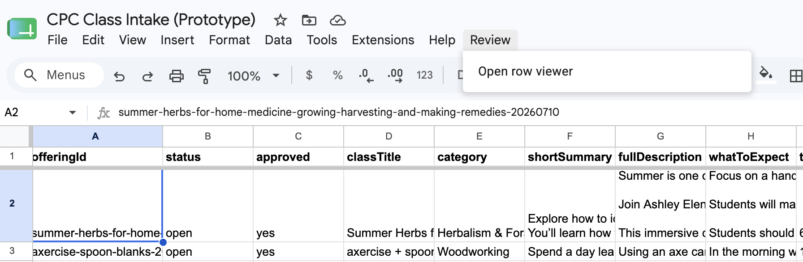

# CPC Class Intake: Google Side How-To

This document covers everything that lives on the Google side of the Center for People and Craft class pipeline. The static site (Metalsmith) consumes what this produces but is documented elsewhere.

## The moving parts

Everything runs under the dev Google account `devoweb91@gmail.com`. There are three artifacts, all created by one script:

1. **A Google Form** ("CPC Class Intake") that class owners fill out, one submission per offering. A multi-session class is one submission with multiple session date pickers filled in.
2. **A Google Spreadsheet** with three tabs. *Form Responses 1* is the raw, untouched form output. *Offerings* holds one row per offering with all prose, fees, instructor info, and a stable `offeringId` like `staked-side-table-20260715`. *Sessions* holds one row per dated session with a `sessionId` like `staked-side-table-20260715-s2`, plus empty `hostName`, `hostEmail`, and `signedUpAt` columns that the volunteer signup flow fills later.
3. **An Apps Script project** containing `cpc-class-intake-prototype.gs`. It builds the form and spreadsheet, and its `handleFormSubmit` trigger converts each raw form submission into the normalized Offerings and Sessions rows.

A fourth artifact is not created by the script: a small script project bound to the spreadsheet. It provides the review sidebar (see "The review sidebar" below) and the submission notification email (see "Submission notification emails" below).

> The spreadsheet is the editable source of truth. If a submission has a typo, fix it in the Offerings or Sessions tab. A submitted form cannot be edited or resubmitted; all a class owner could do is fill out the form again, which creates a duplicate offering with a `-2` suffix. Never ask for that; make the correction in the spreadsheet.

Org-wide boilerplate (accessibility text, cancellation policy, location, scholarship link) deliberately does not live in the spreadsheet. It belongs in the site repo config.

## Routine tasks

These are the recurring jobs. Everything below this section is setup work that happens once (or once per schema change).

**Approve a new class.** Open the spreadsheet, Offerings tab, find the new row, type `yes` in its `approved` column. Until then the class is invisible to the website, both in builds and in the live availability feed. This is the spam gate; every submission needs it. Then rebuild the site (or wait for the next scheduled build).

**Rotate the volunteer code.** In the Apps Script editor: gear icon (Project Settings) > Script Properties > edit the `volunteerCode` value > Save. Announce the new code in the next volunteer email. Takes effect immediately, no redeployment. Matching ignores case and surrounding spaces. If the property is missing entirely, all signups are rejected.

**Fix a submission.** Edit the Offerings or Sessions row directly in the spreadsheet. Type dates as `2026-07-15` and times as `18:00` (the cells are plain text and stay that way). Never change `offeringId` or `sessionId` once a class page is live, and never ask a class owner to fill out the form a second time; that creates a duplicate offering, not a correction. **A viewer is available to review and edit class info. Click on Review and select Open row viewer.**

**Mark a class full or cancelled.** Set its `status` column in Offerings (and per-session in Sessions if only one session is affected). Approval stays `yes`; status controls how the class renders, approval controls whether it exists at all.

**Clear a host signup** (volunteer backs out). In the Sessions tab, clear that row's `hostName`, `hostEmail`, and `signedUpAt` cells. The slot immediately shows "(host needed)" again on the live page.

**Add class images.** When an instructor emails images, commit them to the site repo at `/assets/images/classes/<givebutter-campaign-slug>/` with exactly the file names the instructor entered in the form. The build warns about any image it can't find.

**Change notification recipients.** Open the spreadsheet, Extensions > Apps Script (the bound "Sheet review" project), then Project Settings (gear icon) > Script Properties > edit the `notifyRecipients` value: a comma-separated list of email addresses, e.g. `ann@example.org, bob@example.org`. Save. No code changes, no redeployment; takes effect on the next submission. With the property missing or empty, no email is sent (a warning appears on the Executions page). ⚠️ **Pending setup step: the property currently holds a placeholder (`werner@glinka.co`); replace it with the real reviewer addresses (up to about four) once they are known.**

## Adding a field mid-season (no rebuild, no data loss)

Adding a question to the form while classes are live does NOT require a rebuild. The trigger writes rows by column name, not position, so live sheets can grow new columns safely.

1. Open the live form in the Forms editor and add the question by hand.
2. In the script, add the field to `QUESTIONS`, to `OFFERING_COLUMNS` (or `SESSION_COLUMNS`), to `buildOfferingRecord`, and to `createIntakeForm` (so future rebuilds match). Save.
3. Run `migrateSheets` from the function dropdown. It appends the missing column to the live sheet and logs what it did. All existing offerings, sessions, and host signups stay exactly as they were; old rows just have an empty cell in the new column.
4. Backfill old rows by hand if the new field applies to them, and update the site code to use the new field.

## Building from scratch (or rebuilding)

A full rebuild is only for destructive schema changes: renaming or removing columns or questions. Save those for the off-season. (Adding fields is handled without a rebuild; see the previous section.)

1. Go to https://script.google.com while signed in as `devoweb91@gmail.com` and open the project (or create a new one).
2. Paste the current `cpc-class-intake-prototype.gs` over the entire contents of Code.gs and save.
3. Open the Triggers panel (clock icon in the left sidebar) and delete any existing triggers. Stale triggers point at deleted spreadsheets and will fail silently.
4. Trash the old form and old spreadsheet in Drive, then empty the Drive trash. The old and new files share the same name, and leaving both around is how the wrong one gets deleted later.
5. Select `buildPrototype` in the function dropdown in the toolbar and click Run. Grant permissions if asked.
6. Open the execution log. It prints three URLs: the spreadsheet, the form's edit view, and the form's live view. Save these somewhere.
7. Re-install the bound project. It was bound to the old spreadsheet and died with it: open the new spreadsheet, Extensions > Apps Script, paste `Code.gs`, add the `ReviewSidebar` HTML file (see "The review sidebar" below), add `ClassIntakeTrigger.gs` and its installable trigger, and re-add the notification note question to the form (see "Submission notification emails" below).
8. Run `installBackupTrigger` from the function dropdown. Step 3 deleted the weekly backup trigger along with everything else.

Order matters in steps 3 through 5: triggers first, then old files, then rebuild. Running `buildPrototype` before cleaning up leaves you with two identically named forms and spreadsheets.

### What a full rebuild changes, and what survives

A rebuild replaces some pieces and leaves others alone. Knowing which is which prevents both missed steps and unnecessary ones.

**Destroyed and replaced:** the spreadsheet (all offering, session, and host data is gone; a rebuild is only for the off-season), the form and therefore its public `/viewform` URL (class owners holding the old link get a dead page, so re-share the new link after republishing), the `spreadsheetId` and `formId` Script Properties (rewritten automatically by `buildPrototype`), the bound review sidebar script (step 7), and the weekly backup trigger (step 8; the backup folder and its copies survive).

**Survives untouched:** the Apps Script project itself, the web app deployment and its `/exec` URL (the site config needs no change), the `buildToken` and `volunteerCode` Script Properties (no need to rerun `setupWebApp` or re-announce the code), and everything in the site repo.

The web app does not strictly need a redeploy after a rebuild, because it looks up the spreadsheet ID from Script Properties at request time. But if the rebuild changed any script code, publish a new version (Manage deployments > pencil > New version) so the deployed snapshot matches the repo; it costs nothing and removes doubt.

## Backups

The spreadsheet is the only stateful thing in the whole system; the scripts, plugins, and docs all live in the site repo, and the form can be rebuilt from the script. So backing up means backing up the spreadsheet.

**Automatic weekly backups** are built into the intake script. Run `installBackupTrigger` once from the function dropdown (it asks for Drive permission on first run, a one-time re-authorization). From then on, every Monday between 4 and 5 am the script copies the spreadsheet into a Drive folder named "CPC Class Data Backups," creating the folder if needed, and keeps the newest eight copies, trashing older ones. The copies are ordinary Sheets files named with their date; restoring means opening one and copying the needed rows (or the whole tabs) back. `backupSpreadsheet` can also be run by hand from the function dropdown before anything risky. The backup follows a rebuilt spreadsheet automatically, but the trigger itself is deleted by the rebuild procedure's clean-out step, so rerunning `installBackupTrigger` is part of the rebuild checklist.

Before anything destructive (a rebuild, a bulk edit, emptying the Drive trash), also download a local copy: File > Download > Microsoft Excel (.xlsx). That one file preserves all three tabs, including host signups, and lives outside the Google account entirely, which matters if the account itself is ever the problem.

Restoring after an accident: the first stop is built in. Sheets keeps full version history (File > Version history > See version history), which can roll back the whole spreadsheet or show what a specific edit changed. The downloaded `.xlsx` is the fallback for the disasters version history cannot fix, like the file itself being trashed and the trash emptied.

## Where every value lives

A map of the moving values, for when something needs rotating, or when someone wonders where a mystery string came from.

| Value | Lives in | Also known to | Breaks what if changed carelessly |
|---|---|---|---|
| `/exec` web app URL | The deployment (Manage deployments) | Site build config, class page JS, `.web-app` note file | Build fetch and live signup both go dark if a new deployment replaces the old one |
| `buildToken` | Script Properties | Site build environment (`CPC_SHEET_TOKEN` in `.env`) | Builds get the public payload instead of full data (classes vanish from the site) |
| `volunteerCode` | Script Properties | Volunteer emails | Signups rejected until the new code is announced |
| `spreadsheetId`, `formId` | Script Properties | Nothing else (managed by `buildPrototype`) | Everything; never edit these by hand |
| `notifyRecipients` | Script Properties of the bound "Sheet review" project (not the intake project) | Nothing else | Submission notification emails stop (silently, apart from an Executions-page warning) |
| Form `/viewform` URL | The form (changes on rebuild) | Class owners | Class owners can no longer submit |
| Spreadsheet URL | Drive (changes on rebuild) | Reviewer bookmarks | Stale bookmarks open the trashed sheet, which still accepts edits until the trash is emptied |

The Google account (`devoweb91@gmail.com` in development, the org's account in production) owns all of it: spreadsheet, form, script project, deployment, and triggers. Losing access to that account means losing the system, so its recovery options (recovery email, phone) deserve the same care as the data. This is one more reason production should run under the org's account rather than a personal one.

## Publishing the form

A newly built form does not accept responses until published.

1. Open the form's edit URL.
2. Click Publish (top right) and confirm.
3. Under responder settings, set access to "Anyone with the link."
4. Share the live `/viewform` URL with class owners.

No question requires respondents to sign in to Google.

## Testing the pipeline

Run `submitTestOffering` from the same function dropdown in the Apps Script editor. It submits a realistic three-session woodworking class through the real form, which fires the real trigger. Check the spreadsheet afterwards: one new row in Offerings, three in Sessions with dates 2026-07-15/22/29, times 18:00 and 21:00, and empty host columns.

The test data is fictional, so delete those rows (one in Offerings, three in Sessions) before real use. Delete the corresponding row in Form Responses 1 too if you want that tab clean, though nothing reads it.

## Editing rules for the spreadsheet

Dates and times in Sessions are stored as plain text on purpose: `2026-07-15` and `18:00`, exactly what the site's build fetch expects. The trigger formats each row as plain text before writing, so new rows are safe. If you edit a date cell by hand, type it in the same ISO form; the cell keeps its plain-text format, so Sheets will not convert it.

The `offeringId` and `sessionId` columns are referenced by the website and by volunteer signups. Never change them after a class page is live.

The `status` column starts as `open`. Set it to whatever the site build understands (for example `full` or `cancelled`) to change how the class renders. A submission whose dates could not be parsed arrives with status `needs-review`; fix the Sessions rows by hand and flip the status.

**Every new submission requires approval before it can appear anywhere.** The `approved` column in Offerings arrives empty, and the web app excludes unapproved offerings from both the build payload and the public availability payload; the form is publicly reachable, so this is the spam gate. Review the submission and type `yes` in the `approved` cell to publish it (case does not matter). Anything else, or an empty cell, keeps it invisible to the website. New-submission email notifications are handled by the bound project's `ClassIntakeTrigger.gs` (see "Submission notification emails" below). The intake script's older `ADMIN_NOTIFICATION_EMAIL` constant must stay empty; setting it would send a second, redundant email per submission.

## Known pitfalls

Images travel outside the Google pipeline entirely, by design. Instructors email their image files to the webmaster and enter only the file names in the form ("side-table.jpg"). The webmaster commits the files to the site repo at `/assets/images/classes/<givebutter-campaign-slug>/` (for an offering without a Givebutter campaign yet, the folder is the slugified class title, e.g. `staked-side-table`). The build resolves the file names against that folder and prints a warning for any image that has not arrived, omitting it from the page rather than shipping a broken reference. The Forms API cannot create file-upload questions, and a manual upload question would force instructors to sign in to Google.

Trashed Google files remain reachable by ID until the trash is emptied. A "deleted" spreadsheet can still silently receive trigger writes, which makes debugging confusing. Empty the trash after cleanup.

If `submitTestOffering` errors with something like "not found," the script's stored IDs point at deleted files. That means `buildPrototype` has not been rerun since the last cleanup.

## The web app (read and write API)

The second script file, `cpc-web-app.gs`, turns the project into the single URL through which everything reads and writes the spreadsheet. The spreadsheet itself is never shared with anyone.

To add it: in the Apps Script editor, click + next to Files, name the new file `cpc-web-app`, and paste the file's contents. Both files live in the same project and share Script Properties, so `buildPrototype` must have been run first.

To deploy:

1. Run `setupWebApp` once from the function dropdown. It generates the build token and prints it in the log. Store that token in the site's build environment (for example `CPC_SHEET_TOKEN`). Running `setupWebApp` again rotates the token, which invalidates the old one.
2. Set the volunteer code: Project Settings (gear icon) > Script Properties > Add script property, key `volunteerCode`, value the current code word. Signups without the correct code are rejected. **To rotate it, just edit the property value and announce the new code in the next volunteer email; no redeployment needed.** With no `volunteerCode` property set, all signups are rejected.
3. Deploy > New deployment > gear icon > Web app. Set "Execute as: Me" and "Who has access: Anyone." Click Deploy and authorize.
4. Copy the `/exec` URL. This is the API URL the site build and the class pages use.
5. After any later code change, do NOT create a new deployment. Use Deploy > Manage deployments > pencil icon > Version: New version. That keeps the `/exec` URL stable. A brand-new deployment gets a different URL and the site would silently keep using the old code.

What the URL does: a GET with `?token=THE_BUILD_TOKEN` returns the full class data as JSON, offerings with their sessions nested inside, for the Metalsmith build. A GET without a token returns only sessionId and a hosted yes/no flag per session, which is what class pages fetch on load to show which sessions still need a host. Volunteer names and emails are never returned publicly; hosted sessions simply show nothing on the page. A POST with a JSON body of `sessionId`, `hostName`, `hostEmail`, and `volunteerCode` claims a hosting slot; it answers `{"ok": true}` on success or `{"ok": false, "error": "taken"}` when someone got there first (also `code` for a wrong volunteer code, `invalid` for bad input, and `not-found` for an unknown session). The code comparison ignores case and surrounding whitespace.

One browser quirk to remember when writing the signup JavaScript: Apps Script cannot answer CORS preflight requests, so the POST must use `Content-Type: text/plain;charset=utf-8` with the JSON as a plain body string. A `Content-Type: application/json` POST triggers a preflight and fails.

A second CORS trap, encountered and solved during testing: if browser fetches fail with "No 'Access-Control-Allow-Origin' header" while the URL works fine when opened directly, the deployment's "Who has access" is set to "Anyone with Google account" instead of "Anyone." Signed-in browser visits succeed, but cross-origin fetches get redirected to a login page without CORS headers. Fix it via Deploy > Manage deployments > pencil icon (the access field is hidden until edit mode) > Who has access: Anyone > Version: New version > Deploy. The incognito-window test tells the truth: the /exec URL must return JSON without a sign-in prompt.

`signup-test.html` in the repo is a standalone test page for the whole browser-facing flow. Open it locally, paste the /exec URL, and it lists sessions and lets you claim one, exercising the same GET and text/plain POST the real class pages will use. It doubles as the reference implementation for the site's signup modal.

## The review sidebar

The `google-scripts/review-sidebar/` files add a "Review" menu to the spreadsheet that opens a sidebar showing the selected row as a labeled, editable record. Long prose fields (descriptions, materials) get roomy auto-growing text boxes instead of a cramped cell, which is the sane way to review and correct submissions in the Offerings tab.

**It goes in its own script project, not the intake project.** The intake/web-app project is a standalone script, and the sidebar needs a container-bound one: the `onOpen` trigger that creates the menu only fires in bound scripts, and `SpreadsheetApp.getUi()` throws outside a bound context. Pasting the sidebar files into the intake project produces no error and no menu.

To install: open the spreadsheet itself, then Extensions > Apps Script. That creates (or opens) the script bound to this spreadsheet. Paste `Code.gs` over the default file. Then click + next to Files, choose HTML, name it exactly `ReviewSidebar`, and paste the HTML file's contents. Save both, reload the spreadsheet, and the Review menu appears after a few seconds. The first use triggers the usual authorization flow, including the "Google hasn't verified this app" interstitial (Advanced > Go to project); each reviewer authorizes once.

To operate: click any cell in a row, open Review > Open row viewer, and the sidebar shows that row with the column headers as field labels. Edit directly in the sidebar; a Save/Discard bar appears when anything differs from the sheet. Save writes only the changed cells and refreshes from the sheet. While unsaved edits exist, the sidebar deliberately stops following your cell selection so clicking around cannot wipe work in progress. Formula cells render read-only. Edits behave like typing into the cell, so the plain-text date and time cells stay plain text; use the same ISO forms as always (`2026-07-15`, `18:00`).

Maintenance is nearly zero. Field labels come from the header row at read time, so adding columns (including via `migrateSheets`) requires no sidebar changes. The one thing that breaks it is a full rebuild: `buildPrototype` creates a brand-new spreadsheet, and the bound sidebar script dies with the old one. Re-install the two files into the new spreadsheet after every rebuild; it is a two-minute paste job, but it is not automatic.

## Submission notification emails

Every form submission triggers a notification email to a short list of reviewers. The email contains all submitted facts in column order, the offering ID (same slug convention as the Offerings tab), and, when the class owner filled it in, their optional message from the form's last question ("Note for the announcement email"). That question is optional and feeds only the email; the offerings pipeline ignores it.

The mechanism lives in the spreadsheet-bound "Sheet review" project, in `ClassIntakeTrigger.gs` (repo copy in `google-scripts/review-sidebar/`), wired to an installable "On form submit" trigger. It writes nothing to the sheet; the intake project's `handleFormSubmit` remains the only writer. Recipients live in the bound project's `notifyRecipients` Script Property as a comma-separated list, so an admin can change them from Project Settings without touching code (see "Change notification recipients" under Routine tasks). Note this is the bound project's Script Properties, not the intake project's, which has its own. ⚠️ **The property still holds a placeholder address; set the real reviewer emails once they are known.**

The email is sent from the Google account that owns the trigger, so the trigger should be installed by the org account in production. Quota is generous for this use: 100 recipients/day on a consumer Gmail account, 1,500/day on Workspace.

Two rebuild caveats, both consequences of `buildPrototype` creating a brand-new form and spreadsheet:

1. The bound project dies with the old spreadsheet, exactly like the review sidebar, taking its Script Properties with it. After a rebuild, paste `ClassIntakeTrigger.gs` into the new bound project, re-create the `notifyRecipients` Script Property (Project Settings > Script Properties), and re-create the installable trigger (Triggers > Add Trigger > function `onFormSubmit`, event source "From spreadsheet", event type "On form submit"; a simple trigger cannot send email).
2. The "Note for the announcement email" question was added to the live form by hand and is not part of `createIntakeForm`, so a rebuilt form will not have it. Re-add it manually (Paragraph type, optional, at the end of the form), or fold it into the intake script's form builder before the next rebuild.

## Still to build

The Metalsmith plugin that fetches the token-gated GET at build time, and the class page signup JavaScript that does the public GET on load and the POST on submit.

The real recipient list for submission notification emails: replace the placeholder in the bound project's `notifyRecipients` Script Property once the reviewer addresses are known (see "Submission notification emails").

For production, rerun the whole build under the org's own Google account rather than the dev account. The procedure is identical, including the web app deployment.
